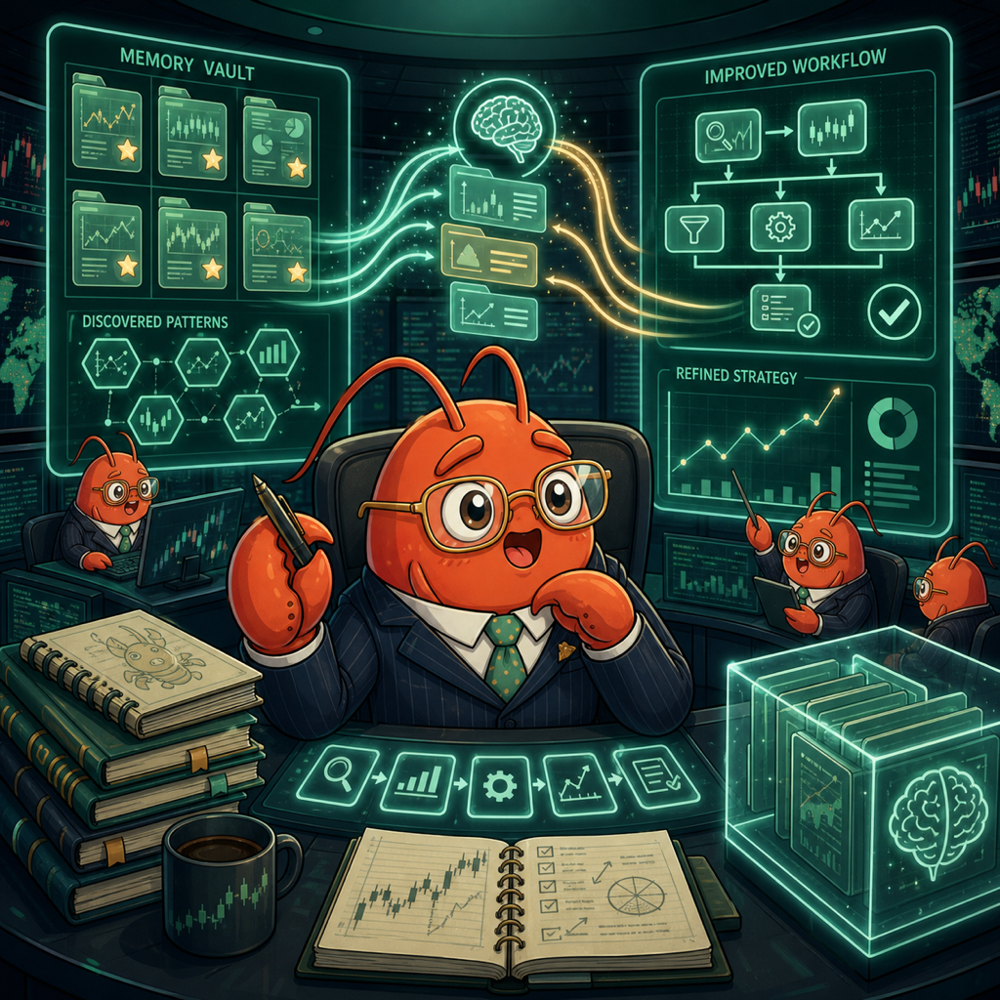
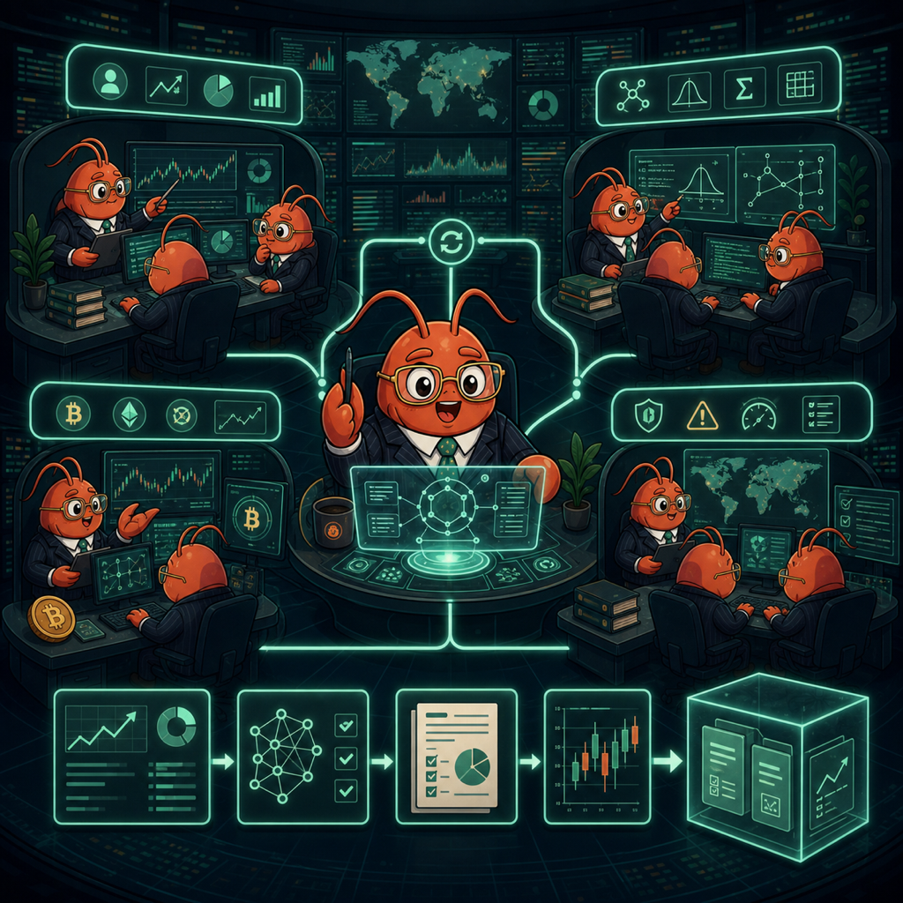
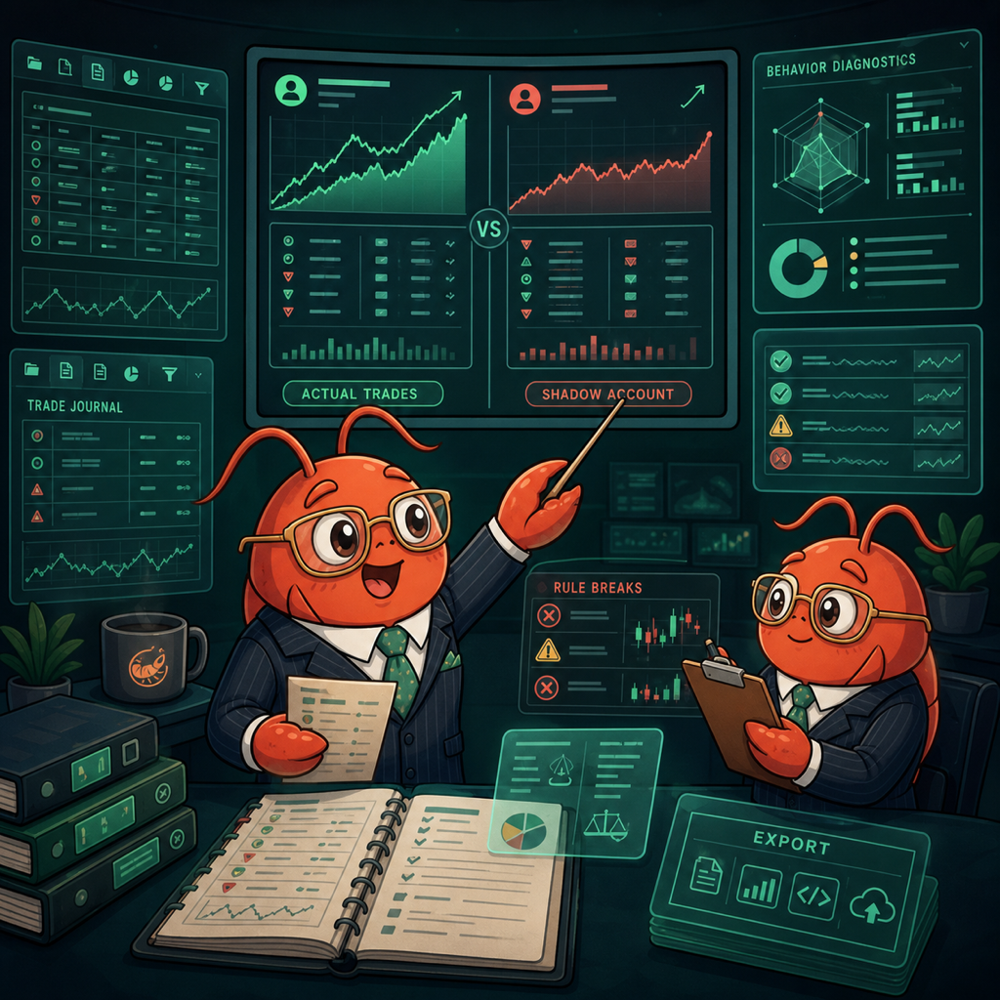

<p align="center">
  <b>English</b> | <a href="README_zh.md">中文</a> | <a href="README_ja.md">日本語</a> | <a href="README_ko.md">한국어</a> | <a href="README_ar.md">العربية</a>
</p>

<p align="center">
  
</p>

<h1 align="center">Vibe-Trading: Your Personal Trading Agent</h1>

<p align="center">
  <b>One Command to Empower Your Agent with Comprehensive Trading Capabilities</b>
</p>

<p align="center">
  
  
  
  <a href="https://pypi.org/project/vibe-trading-ai/"></a>
  <a href="LICENSE"></a>
  <br>
  <a href="https://github.com/HKUDS/.github/blob/main/profile/README.md"></a>
  <a href="https://github.com/HKUDS/.github/blob/main/profile/README.md"></a>
  <a href="https://discord.gg/2vDYc2w5"></a>
</p>

<p align="center">
  <a href="https://vibetrading.wiki/">Website</a> &nbsp;&middot;&nbsp;
  <a href="https://vibetrading.wiki/docs/">Docs</a> &nbsp;&middot;&nbsp;
  <a href="#-news">News</a> &nbsp;&middot;&nbsp;
  <a href="#-key-features">Features</a> &nbsp;&middot;&nbsp;
  <a href="#-shadow-account">Shadow Account</a> &nbsp;&middot;&nbsp;
  <a href="#-demo">Demo</a> &nbsp;&middot;&nbsp;
  <a href="#-quick-start">Quick Start</a> &nbsp;&middot;&nbsp;
  <a href="#-examples">Examples</a> &nbsp;&middot;&nbsp;
  <a href="#-api-server">API / MCP</a> &nbsp;&middot;&nbsp;
  <a href="#-roadmap">Roadmap</a> &nbsp;&middot;&nbsp;
  <a href="#-contributing">Contributing</a>
</p>

<p align="center">
  <a href="#-quick-start"></a>
</p>

---

## 📰 News

- **2026-05-15** 🪪 The run detail page now surfaces the Trust Layer run card alongside metrics and artifacts, completing the UI side of the `run_card.json` work landed on 2026-05-12. `PersistentMemory.add()` was also hardened on length, empty/whitespace-only names, and C0/C1 control bytes from the #108/#109/#110 triage ([#112](https://github.com/HKUDS/Vibe-Trading/pull/112), thanks @Teerapat-Vatpitak).
- **2026-05-14** 🌐 the public wiki is now live at [vibetrading.wiki](https://vibetrading.wiki/) with docs, tutorials, Research Lab, and Alpha Library sections deployed through Cloudflare Pages. Persistent memory is also inspectable from the CLI via `vibe-trading memory list/show/search/forget` ([#102](https://github.com/HKUDS/Vibe-Trading/pull/102), thanks @Teerapat-Vatpitak), and memory tokenization/slugs now support Thai, Arabic, Hebrew, and Cyrillic text ([#104](https://github.com/HKUDS/Vibe-Trading/pull/104)).
- **2026-05-13** 🧭 Swarm runs now ground workers with fetched market data and cleaner persisted reports ([#93](https://github.com/HKUDS/Vibe-Trading/pull/93), [#84](https://github.com/HKUDS/Vibe-Trading/pull/84)).

<details>
<summary>Earlier news</summary>

- **2026-05-12** 🧾 Backtests now emit `run_card.json` and `run_card.md` alongside artifacts for reproducible research runs.
- **2026-05-11** 🧭 **Memory slugs, swarm accounting, and CLI preflight**: Persistent memory now preserves CJK characters when generating file slugs, preventing silent filename collisions for Chinese/Japanese/Korean notes ([#95](https://github.com/HKUDS/Vibe-Trading/pull/95), thanks @voidborne-d). Swarm run totals now prefer provider-reported token usage with the existing estimate fallback ([#94](https://github.com/HKUDS/Vibe-Trading/pull/94), thanks @Teerapat-Vatpitak), and the CLI run UI gained a startup preflight check for common environment issues ([#96](https://github.com/HKUDS/Vibe-Trading/pull/96), thanks @ykykj).
- **2026-05-10** 🧱 **Regression guardrails + run metadata**: Memory recall now treats underscores as token boundaries, so snake_case saved memories such as `mcp_wiring_test` match natural-language queries like "mcp wiring" ([#87](https://github.com/HKUDS/Vibe-Trading/pull/87), thanks @hp083625). The MCP server has a subprocess smoke test covering initialize → `tools/list` → `tools/call` to guard the first-call deadlock path ([#86](https://github.com/HKUDS/Vibe-Trading/pull/86)), while low-risk hardening landed for Windows path-sensitive tests, API best-effort exception handling, backtest `run_dir` allowed-root validation, and SwarmRun provider/model metadata ([#88](https://github.com/HKUDS/Vibe-Trading/pull/88), [#90](https://github.com/HKUDS/Vibe-Trading/pull/90), [#91](https://github.com/HKUDS/Vibe-Trading/pull/91), [#92](https://github.com/HKUDS/Vibe-Trading/pull/92), thanks @Teerapat-Vatpitak).
- **2026-05-09** 🛡️ **API path hardening + MCP server stability**: API run/session routes now validate path IDs before lookup, rejecting malformed newline-containing parameters and pinning the behavior in the auth/security regression suite ([#80](https://github.com/HKUDS/Vibe-Trading/pull/80), thanks @SJoon99). The MCP server now pre-warms the tool registry on the main thread before serving `tools/call`, avoiding a first-call deadlock in lazy tool discovery ([#85](https://github.com/HKUDS/Vibe-Trading/pull/85), thanks @Teerapat-Vatpitak). The Vite dev proxy also honors `VITE_API_URL` for non-default backend targets ([#82](https://github.com/HKUDS/Vibe-Trading/pull/82), thanks @voidborne-d).
- **2026-05-08** 🧾 **Tushare statement fields in filters**: A-share daily backtests can now request PIT-safe financial statement fields through `fundamental_fields`, so signal engines can screen on `income_total_revenue`, `income_n_income`, `balancesheet_total_hldr_eqy_exc_min_int`, `fina_indicator_roe`, and similar table-prefixed columns after their announcement/disclosure dates ([#76](https://github.com/HKUDS/Vibe-Trading/pull/76), thanks @mrbob-git). Follow-up hardening makes explicit statement-field requests fail fast if Tushare enrichment cannot run, instead of silently falling back to raw price bars ([#77](https://github.com/HKUDS/Vibe-Trading/pull/77)).
- **2026-05-07** 📈 **Tushare fundamentals + community triage**: Added a point-in-time `TushareFundamentalProvider` contract for fundamental research workflows, with regression coverage for the project `TUSHARE_TOKEN` environment path ([#74](https://github.com/HKUDS/Vibe-Trading/pull/74)). Community triage also clarified that Vibe-Trading keeps rapid iteration focused on one UI language for now, avoids adding redundant search dependencies while DuckDuckGo-backed `web_search` is already bundled, and treats unofficial hosted deployments as untrusted places for API keys or data-source tokens.
- **2026-05-06** 🚀 **v0.1.7 released** ([Release notes](https://github.com/HKUDS/Vibe-Trading/releases/tag/v0.1.7), `pip install -U vibe-trading-ai`): Security-boundary hardening is now published on PyPI and ClawHub, covering safer API/read/upload/file/URL/generated-code/shell-tool/Docker defaults while keeping localhost CLI/Web UI workflows low-friction. This cycle also includes Web UI Settings, correlation heatmap, OpenAI Codex OAuth, A-share pre-ST filtering, interactive CLI UX, swarm preset inspection, dividend analysis, dev workflow polish, and audited frontend build-dependency floors. Thanks to the 0.1.7 contributors and to lemi9090 (S2W) for coordinated security validation.
- **2026-05-05** 🛡️ **Security boundary follow-up**: Completes the remaining security-boundary hardening around explicit CORS origins, Settings credential indicators, web URL reading, and Shadow Account code generation, with regression tests added for each path. Normal localhost CLI/Web UI workflows stay the same; remote deployments should continue using `API_AUTH_KEY` and explicit trusted origins.
- **2026-05-04** 🖥️ **Interactive CLI UX + CI cleanup**: Interactive mode now has a live bottom status bar showing provider/model, session duration, last-run latency, and cumulative tool-call stats, plus prompt history navigation and cursor editing with arrow keys via `prompt_toolkit` ([#69](https://github.com/HKUDS/Vibe-Trading/pull/69)). The CLI still falls back to Rich prompts when `prompt_toolkit` or a TTY is unavailable. CI path expectations were also aligned with the hardened file-import sandbox and cross-platform `/tmp` resolution, returning main to green ([`bb67dc7`](https://github.com/HKUDS/Vibe-Trading/commit/bb67dc7cfcc11553c57d8962bee56381dca43758)).
- **2026-05-03** 🛡️ **Security hardening patch**: Tightens default API authentication for non-local deployments, protects sensitive run/session/swarm reads, restricts upload and local file-reading boundaries, gates shell-capable tools by entry point, validates generated strategy loading before import, and runs the Docker image as a non-root user with a localhost-only published port by default. Local CLI and localhost Web UI workflows remain low-friction; remote API/Web deployments should set `API_AUTH_KEY`.
- **2026-05-02** 🧭 **Dividend analysis + sharper roadmap**: Added the `dividend-analysis` skill for income stocks, payout sustainability, dividend growth, shareholder yield, ex-dividend mechanics, and yield-trap checks, pinned by bundled-skill regression tests. The public roadmap now focuses on upcoming work: Research Autopilot, Data Bridge, Options Lab, Portfolio Studio, Alpha Zoo, Research Delivery, Trust Layer, and Community sharing.
- **2026-05-01** 🔥 **Correlation heatmap + OpenAI Codex OAuth + A-share pre-ST filter**: New correlation dashboard/API computes rolling return correlations and renders an ECharts heatmap for portfolio and symbol analysis ([#64](https://github.com/HKUDS/Vibe-Trading/pull/64)). OpenAI Codex provider support now uses ChatGPT OAuth via `vibe-trading provider login openai-codex`, with Settings metadata and adapter regression tests ([#65](https://github.com/HKUDS/Vibe-Trading/pull/65)). Added and hardened the `ashare-pre-st-filter` skill for A-share ST/*ST risk screening, including Sina penalty relevance filtering so securities-account mentions do not inflate E2 counts ([#63](https://github.com/HKUDS/Vibe-Trading/pull/63)).
- **2026-04-30** ⚙️ **Web UI Settings + validation CLI hardening**: New Settings page for LLM provider/model, base URL, reasoning effort, and data source credentials, backed by local/auth-protected settings APIs and data-driven provider metadata ([#57](https://github.com/HKUDS/Vibe-Trading/pull/57)). Also hardens `python -m backtest.validation <run_dir>` so missing, blank, malformed, non-existent, and non-directory inputs fail with clear operator-facing messages before validation starts ([#60](https://github.com/HKUDS/Vibe-Trading/pull/60)).
- **2026-04-28** 🚀 **v0.1.6 released** (`pip install -U vibe-trading-ai`): Fixes `vibe-trading --swarm-presets` returning empty after `pip install` / `uv tool install` ([#55](https://github.com/HKUDS/Vibe-Trading/issues/55)) — preset YAMLs now bundled inside the `src.swarm` package and pinned by a 6-test regression suite. Plus AKShare loader correctly routes ETFs (`510300.SH`) and forex (`USDCNH`) to the right endpoints with hardened registry fallback. Rolls up everything since v0.1.5: benchmark comparison panel, `/upload` streaming + size limits, Futu loader (HK + A-share), vnpy export skill, security hardening, frontend lazy loading (688KB → 262KB).
- **2026-04-27** 📊 **Benchmark panel + upload safety**: Backtest output now ships a benchmark comparison panel (ticker / benchmark return / excess return / information ratio) with yfinance-backed resolution for SPY, CSI 300, etc. ([#48](https://github.com/HKUDS/Vibe-Trading/issues/48)). Plus `/upload` streams the request body in 1 MB chunks and aborts past `MAX_UPLOAD_SIZE`, bounding memory under oversized/malformed clients ([#53](https://github.com/HKUDS/Vibe-Trading/pull/53)) — pinned by a 4-case regression suite.
- **2026-04-22** 🛡️ **Hardening + new integrations**: Path containment enforced in `safe_path` + journal/shadow tool sandbox, `MANIFEST.in` ships `.env.example` / tests / Docker files in sdist, route-level lazy loading shrinks frontend initial bundle 688KB → 262KB. Plus Futu data loader for HK & A-share equities ([#47](https://github.com/HKUDS/Vibe-Trading/pull/47)) and vnpy CtaTemplate export skill ([#46](https://github.com/HKUDS/Vibe-Trading/pull/46)).
- **2026-04-21** 🛡️ **Workspace + docs**: Relative `run_dir` normalized to active run dir ([#43](https://github.com/HKUDS/Vibe-Trading/pull/43)). README usage examples ([#45](https://github.com/HKUDS/Vibe-Trading/pull/45)).
- **2026-04-20** 🔌 **Reasoning + Swarm**: `reasoning_content` preserved across all `ChatOpenAI` paths — Kimi / DeepSeek / Qwen thinking work end-to-end ([#39](https://github.com/HKUDS/Vibe-Trading/issues/39)). Swarm streaming + clean Ctrl+C ([#42](https://github.com/HKUDS/Vibe-Trading/issues/42)).
- **2026-04-19** 📦 **v0.1.5**: Published to PyPI & ClawHub. `python-multipart` CVE floor bump, 5 new MCP tools wired (`analyze_trade_journal` + 4 shadow-account tools), `pattern_recognition` → `pattern` registry fix, Docker dep parity, SKILL manifest synced (22 MCP tools / 71 skills).
- **2026-04-18** 👥 **Shadow Account**: Extract your strategy rules from a broker journal → backtest the shadow across markets → 8-section HTML/PDF report showing exactly how much you leave on the table (rule violations, early exits, missed signals, counterfactual trades). 4 new tools, 1 skill, 32 tools total. Trade Journal + Shadow Account samples now live in the web UI welcome screen.
- **2026-04-17** 📊 **Trade Journal Analyzer + Universal File Reader**: Upload broker exports (同花顺/东财/富途/generic CSV) → auto trading profile (holding days, win rate, PnL ratio, drawdown) + 4 bias diagnostics (disposition effect, overtrading, chasing momentum, anchoring). `read_document` now dispatches PDF, Word, Excel, PowerPoint, images (OCR), and 40+ text formats behind one unified call.
- **2026-04-16** 🧠 **Agent Harness**: Persistent cross-session memory, FTS5 session search, self-evolving skills (full CRUD), 5-layer context compression, read/write tool batching. 27 tools, 107 new tests.
- **2026-04-15** 🤖 **Z.ai + MiniMax**: Z.ai provider ([#35](https://github.com/HKUDS/Vibe-Trading/pull/35)), MiniMax temperature fix + model update ([#33](https://github.com/HKUDS/Vibe-Trading/pull/33)). 13 providers.
- **2026-04-14** 🔧 **MCP Stability**: Fixed backtest tool `Connection closed` error on stdio transport ([#32](https://github.com/HKUDS/Vibe-Trading/pull/32)).
- **2026-04-13** 🌐 **Cross-Market Composite Backtest**: New `CompositeEngine` backtests mixed-market portfolios (e.g. A-shares + crypto) with shared capital pool and per-market rules. Also fixed swarm template variable fallback and frontend timeout.
- **2026-04-12** 🌍 **Multi-Platform Export**: `/pine` exports strategies to TradingView (Pine Script v6), TDX (通达信/同花顺/东方财富), and MetaTrader 5 (MQL5) in one command.
- **2026-04-11** 🛡️ **Reliability & DX**: `vibe-trading init` .env bootstrap ([#19](https://github.com/HKUDS/Vibe-Trading/pull/19)), preflight checks, runtime data-source fallback, hardened backtest engine. Multi-language README ([#21](https://github.com/HKUDS/Vibe-Trading/pull/21)).
- **2026-04-10** 📦 **v0.1.4**: Docker fix ([#8](https://github.com/HKUDS/Vibe-Trading/issues/8)), `web_search` MCP tool, 12 LLM providers, `akshare`/`ccxt` deps. Published to PyPI and ClawHub.
- **2026-04-09** 📊 **Backtest Wave 2**: ChinaFutures, GlobalFutures, Forex, Options v2 engines. Monte Carlo, Bootstrap CI, Walk-Forward validation.
- **2026-04-08** 🔧 **Multi-market backtest** with per-market rules, Pine Script v6 export, 5 data sources with auto-fallback.

</details>

---

## ✨ Key Features

<div align="center">
<table align="center" width="94%" style="width:94%; margin-left:auto; margin-right:auto;">
  <tr>
    <td align="center" width="50%" valign="top">
      <br>
      <h3>🔍 Self-Improving Trading Agent</h3>
      <div align="left">
        • Natural-language market research<br>
        • Strategy drafts and file/web analysis<br>
        • Memory-backed workflows
      </div>
    </td>
    <td align="center" width="50%" valign="top">
      <br>
      <h3>🐝 Multi-Agent Trading Teams</h3>
      <div align="left">
        • Investment, quant, crypto, and risk teams<br>
        • Streaming progress and persisted reports<br>
        • Workers grounded with fetched market data
      </div>
    </td>
  </tr>
  <tr>
    <td align="center" width="50%" valign="top">
      <br>
      <h3>📊 Cross-Market Data & Backtesting</h3>
      <div align="left">
        • A/HK/US equities, crypto, futures, and forex<br>
        • Data fallback and composite backtests<br>
        • PIT data, validation, and run cards
      </div>
    </td>
    <td align="center" width="50%" valign="top">
      <br>
      <h3>👥 Shadow Account</h3>
      <div align="left">
        • Broker-journal behavior diagnostics<br>
        • Rule-based Shadow Account comparisons<br>
        • Exportable audit reports and strategy code
      </div>
    </td>
  </tr>
</table>
</div>

## 💡 What Is Vibe-Trading?

Vibe-Trading is an open-source research workspace for turning finance questions into runnable analysis. It connects natural-language prompts to market-data loaders, strategy generation, backtest engines, reports, exports, and persistent research memory.

It is designed for research, simulation, and backtesting. It does not execute live trades.

---

## ✨ What You Can Do

| Task | Output |
|------|--------|
| **Ask a trading question** | Market research with tools, data, documents, and reusable session context. |
| **Backtest a strategy idea** | Strategy code, metrics, benchmark context, validation artifacts, and run cards. |
| **Review your own trades** | Broker-journal parsing, behavior diagnostics, rule extraction, and Shadow Account comparisons. |
| **Improve repeated research** | Persistent memory and editable skills turn useful routines into reusable workflows. |
| **Run analyst teams** | Multi-agent research reviews for investment, quant, crypto, macro, and risk workflows. |
| **Ship usable artifacts** | Reports, TradingView Pine Script, TDX, MetaTrader 5, MCP tools, and later research sessions. |

---

## ⚡ Quick Example

```bash
pip install vibe-trading-ai
vibe-trading run -p "Backtest a BTC-USDT 20/50 moving-average strategy for 2024, summarize return and drawdown, then export the report"
```

```bash
vibe-trading --upload trades_export.csv
vibe-trading run -p "Analyze my trading behavior, extract my shadow strategy, and compare it with my actual trades"
```

---

## 👥 Shadow Account

Shadow Account starts from your own trading records instead of a generic strategy template.

Upload a broker export, let the agent summarize your behavior, then compare the actual trading path with a rule-based shadow strategy.

| Step | Agent output |
|------|--------------|
| **1. Read your journal** | Parses broker exports from 同花顺, 东方财富, 富途, and generic CSV formats. |
| **2. Profile your behavior** | Holding days, win rate, PnL ratio, drawdown, disposition effect, overtrading, momentum chasing, and anchoring checks. |
| **3. Extract your rules** | Turns recurring entries/exits into an explicit strategy profile instead of a hand-wavy summary. |
| **4. Run the shadow** | Backtests the extracted rules and highlights rule breaks, early exits, missed signals, and alternative trade paths. |
| **5. Deliver the report** | Produces an HTML/PDF report that can be inspected, archived, or refined in a later session. |

```bash
vibe-trading --upload trades_export.csv
vibe-trading run -p "Analyze my trading behavior, extract my shadow strategy, and compare it with my actual trades"
```

---

## 🧪 Research Workflow

Most runs follow the same evidence path: route the request, load the right market context, execute tools, validate outputs, and keep the artifacts inspectable.

| Layer | What happens |
|-------|--------------|
| **Plan** | Selects the relevant finance skills, tools, data sources, and swarm preset when useful. |
| **Ground** | Pulls A-shares, HK/US equities, crypto, futures, forex, documents, or web context through the available loaders. |
| **Execute** | Generates testable strategy code, runs tools, and uses the matching backtest engine or analysis workflow. |
| **Validate** | Adds metrics, benchmark comparison, Monte Carlo, Bootstrap, Walk-Forward, run cards, and warnings where applicable. |
| **Deliver** | Returns reports, artifacts, tool traces, and exports for TradingView, TDX, MetaTrader 5, MCP clients, or later sessions. |

---

## 🔩 Detailed Capabilities

Detailed inventories are folded below to keep the main README scannable. Open them when you want to inspect the available building blocks.

<details>
<summary><b>Finance Skill Library</b> <sub>74 skills across 8 categories</sub></summary>

- 📊 74 specialized finance skills organized into 8 categories
- 🌐 Complete coverage from traditional markets to crypto & DeFi
- 🔬 Comprehensive capabilities spanning data sourcing to quantitative research

| Category | Skills | Examples |
|----------|--------|----------|
| Data Source | 6 | `data-routing`, `tushare`, `yfinance`, `okx-market`, `akshare`, `ccxt` |
| Strategy | 17 | `strategy-generate`, `cross-market-strategy`, `technical-basic`, `candlestick`, `ichimoku`, `elliott-wave`, `smc`, `multi-factor`, `ml-strategy` |
| Analysis | 17 | `factor-research`, `macro-analysis`, `global-macro`, `valuation-model`, `earnings-forecast`, `credit-analysis`, `dividend-analysis` |
| Asset Class | 9 | `options-strategy`, `options-advanced`, `convertible-bond`, `etf-analysis`, `asset-allocation`, `sector-rotation` |
| Crypto | 7 | `perp-funding-basis`, `liquidation-heatmap`, `stablecoin-flow`, `defi-yield`, `onchain-analysis` |
| Flow | 7 | `hk-connect-flow`, `us-etf-flow`, `edgar-sec-filings`, `financial-statement`, `adr-hshare` |
| Tool | 10 | `backtest-diagnose`, `report-generate`, `pine-script`, `doc-reader`, `web-reader`, `vnpy-export` |
| Risk Analysis | 1 | `ashare-pre-st-filter` |

</details>

<details>
<summary><b>Preset Trading Teams</b> <sub>29 swarm presets</sub></summary>

- 🏢 29 ready-to-use agent teams
- ⚡ Pre-configured finance workflows
- 🎯 Investment, trading & risk management presets

| Preset | Workflow |
|--------|----------|
| `investment_committee` | Bull/bear debate → risk review → PM final call |
| `global_equities_desk` | A-share + HK/US + crypto researcher → global strategist |
| `crypto_trading_desk` | Funding/basis + liquidation + flow → risk manager |
| `earnings_research_desk` | Fundamental + revision + options → earnings strategist |
| `macro_rates_fx_desk` | Rates + FX + commodity → macro PM |
| `quant_strategy_desk` | Screening + factor research → backtest → risk audit |
| `technical_analysis_panel` | Classic TA + Ichimoku + harmonic + Elliott + SMC → consensus |
| `risk_committee` | Drawdown + tail risk + regime review → sign-off |
| `global_allocation_committee` | A-shares + crypto + HK/US → cross-market allocation |

<sub>Plus 20+ additional specialist presets — run vibe-trading --swarm-presets to explore all.

</sub>

</details>

## 🎬 Demo

<div align="center">
<table>
<tr>
<td width="50%">

https://github.com/user-attachments/assets/4e4dcb80-7358-4b9a-92f0-1e29612e6e86

</td>
<td width="50%">

https://github.com/user-attachments/assets/3754a414-c3ee-464f-b1e8-78e1a74fbd30

</td>
</tr>
<tr>
<td colspan="2" align="center"><sub>☝️ Natural-language backtest & multi-agent swarm debate — Web UI + CLI</sub></td>
</tr>
</table>
</div>

---

## 🚀 Quick Start

### One-line install (PyPI)

```bash
pip install vibe-trading-ai
```

Then run a first research task:

```bash
vibe-trading init
vibe-trading run -p "Backtest a BTC-USDT 20/50 moving-average strategy for 2024 and summarize return and drawdown"
```

> **Package name vs commands:** The PyPI package is `vibe-trading-ai`. Once installed, you get three commands:
>
> | Command | Purpose |
> |---------|---------|
> | `vibe-trading` | Interactive CLI / TUI |
> | `vibe-trading serve` | Launch FastAPI web server |
> | `vibe-trading-mcp` | Start MCP server (for Claude Desktop, OpenClaw, Cursor, etc.) |

```bash
vibe-trading init              # interactive .env setup
vibe-trading                   # launch CLI
vibe-trading serve --port 8899 # launch web UI
vibe-trading-mcp               # start MCP server (stdio)
```

### Or choose a path

| Path | Best for | Time |
|------|----------|------|
| **A. Docker** | Try it now, zero local setup | 2 min |
| **B. Local install** | Development, full CLI access | 5 min |
| **C. MCP plugin** | Plug into your existing agent | 3 min |
| **D. ClawHub** | One command, no cloning | 1 min |

### Prerequisites

- An **LLM API key** from any supported provider — or run locally with **Ollama** (no key needed)
- **Python 3.11+** for Path B
- **Docker** for Path A
- OpenAI Codex can also be used with ChatGPT OAuth: set `LANGCHAIN_PROVIDER=openai-codex`, then run `vibe-trading provider login openai-codex`. This does not use `OPENAI_API_KEY`.

> **Supported LLM providers:** OpenRouter, OpenAI, DeepSeek, Gemini, Groq, DashScope/Qwen, Zhipu, Moonshot/Kimi, MiniMax, Xiaomi MIMO, Z.ai, Ollama (local). See `.env.example` for config.

> **Tip:** All markets work without any API keys thanks to automatic fallback. yfinance (HK/US), OKX (crypto), and AKShare (A-shares, US, HK, futures, forex) are all free. Tushare token is optional — AKShare covers A-shares as a free fallback.

### Path A: Docker (zero setup)

```bash
git clone https://github.com/HKUDS/Vibe-Trading.git
cd Vibe-Trading
cp agent/.env.example agent/.env
# Edit agent/.env — uncomment your LLM provider and set API key
docker compose up --build
```

Open `http://localhost:8899`. Backend + frontend in one container.

Docker publishes the backend on `127.0.0.1:8899` by default and runs the app as a non-root container user. If you intentionally expose the API beyond your own machine, set a strong `API_AUTH_KEY` and send `Authorization: Bearer <key>` from clients.

### Path B: Local install

```bash
git clone https://github.com/HKUDS/Vibe-Trading.git
cd Vibe-Trading
python -m venv .venv

# Activate
source .venv/bin/activate          # Linux / macOS
# .venv\Scripts\Activate.ps1       # Windows PowerShell

pip install -e .
cp agent/.env.example agent/.env   # Edit — set your LLM provider API key
vibe-trading                       # Launch interactive TUI
```

<details>
<summary><b>Start web UI (optional)</b></summary>

```bash
# Terminal 1: API server
vibe-trading serve --port 8899

# Terminal 2: Frontend dev server
cd frontend && npm install && npm run dev
```

Open `http://localhost:5899`. The frontend proxies API calls to `localhost:8899`.

**Production mode (single server):**

```bash
cd frontend && npm run build && cd ..
vibe-trading serve --port 8899     # FastAPI serves dist/ as static files
```

</details>

### Path C: MCP plugin

See [MCP Plugin](#-mcp-plugin) section below.

### Path D: ClawHub (one command)

```bash
npx clawhub@latest install vibe-trading --force
```

The skill + MCP config is downloaded into your agent's skills directory. See [ClawHub install](#-mcp-plugin) for details.

---

## 🧠 Environment Variables

Copy `agent/.env.example` to `agent/.env` and uncomment the provider block you want. Each provider needs 3-4 variables:

| Variable | Required | Description |
|----------|:--------:|-------------|
| `LANGCHAIN_PROVIDER` | Yes | Provider name (`openrouter`, `deepseek`, `groq`, `ollama`, etc.) |
| `<PROVIDER>_API_KEY` | Yes* | API key (`OPENROUTER_API_KEY`, `DEEPSEEK_API_KEY`, etc.) |
| `<PROVIDER>_BASE_URL` | Yes | API endpoint URL |
| `LANGCHAIN_MODEL_NAME` | Yes | Model name (e.g. `deepseek-v4-pro`) |
| `TUSHARE_TOKEN` | No | Tushare Pro token for A-share data (falls back to AKShare) |
| `TIMEOUT_SECONDS` | No | LLM call timeout, default 120s |
| `API_AUTH_KEY` | Recommended for network deployments | Bearer token required when the API is reachable from non-local clients |
| `VIBE_TRADING_ENABLE_SHELL_TOOLS` | No | Explicit opt-in for shell-capable tools in remote API/MCP-SSE style deployments |
| `VIBE_TRADING_ALLOWED_FILE_ROOTS` | No | Extra comma-separated roots for document and broker-journal imports |
| `VIBE_TRADING_ALLOWED_RUN_ROOTS` | No | Extra comma-separated roots for generated-code run directories |

<sub>* Ollama does not require an API key. OpenAI Codex uses ChatGPT OAuth and stores tokens via `oauth-cli-kit`, not in `agent/.env`.</sub>

**Free data (no key needed):** A-shares via AKShare, HK/US equities via yfinance, crypto via OKX, 100+ crypto exchanges via CCXT. The system automatically selects the best available source for each market.

### 🎯 Recommended Models

Vibe-Trading is a tool-heavy agent — skills, backtests, memory, and swarms all flow through tool calls. Model choice directly decides whether the agent *uses* its tools or fabricates answers from training data.

| Tier | Examples | When to use |
|------|----------|-------------|
| **Best** | `anthropic/claude-opus-4.7`, `anthropic/claude-sonnet-4.6`, `openai/gpt-5.4`, `google/gemini-3.1-pro-preview` | Complex swarms (3+ agents), long research sessions, paper-grade analysis |
| **Sweet spot** (default) | `deepseek-v4-pro`, `deepseek/deepseek-v4-pro`, `x-ai/grok-4.20`, `z-ai/glm-5.1`, `moonshotai/kimi-k2.5`, `qwen/qwen3-max-thinking` | Daily driver — reliable tool-calling at ~1/10 the cost |
| **Avoid for agent use** | `*-nano`, `*-flash-lite`, `*-coder-next`, small / distilled variants | Tool-calling is unreliable — the agent will appear to "answer from memory" instead of loading skills or running backtests |

The default `agent/.env.example` ships with DeepSeek official API + `deepseek-v4-pro`; OpenRouter users can use `deepseek/deepseek-v4-pro`.

---

## 🖥 CLI Reference

```bash
vibe-trading               # interactive TUI
vibe-trading run -p "..."  # single run
vibe-trading serve         # API server
```

<details>
<summary><b>Slash commands inside TUI</b></summary>

| Command | Description |
|---------|-------------|
| `/help` | Show all commands |
| `/skills` | List all 74 finance skills |
| `/swarm` | List 29 swarm team presets |
| `/swarm run <preset> [vars_json]` | Run a swarm team with live streaming |
| `/swarm list` | Swarm run history |
| `/swarm show <run_id>` | Swarm run details |
| `/swarm cancel <run_id>` | Cancel a running swarm |
| `/list` | Recent runs |
| `/show <run_id>` | Run details + metrics |
| `/code <run_id>` | Generated strategy code |
| `/pine <run_id>` | Export indicators (TradingView + TDX + MT5) |
| `/trace <run_id>` | Full execution replay |
| `/continue <run_id> <prompt>` | Continue a run with new instructions |
| `/sessions` | List chat sessions |
| `/settings` | Show runtime config |
| `/clear` | Clear screen |
| `/quit` | Exit |

</details>

<details>
<summary><b>Single run & flags</b></summary>

```bash
vibe-trading run -p "Backtest BTC-USDT MACD strategy, last 30 days"
vibe-trading run -p "Analyze AAPL momentum" --json
vibe-trading run -f strategy.txt
echo "Backtest 000001.SZ RSI" | vibe-trading run
```

```bash
vibe-trading -p "your prompt"
vibe-trading --skills
vibe-trading --swarm-presets
vibe-trading --swarm-run investment_committee '{"topic":"BTC outlook"}'
vibe-trading --list
vibe-trading --show <run_id>
vibe-trading --code <run_id>
vibe-trading --pine <run_id>           # Export indicators (TradingView + TDX + MT5)
vibe-trading --trace <run_id>
vibe-trading --continue <run_id> "refine the strategy"
vibe-trading --upload report.pdf
```

</details>

---

## 💡 Examples

### Strategy & Backtesting

```bash
# Moving average crossover on US equities
vibe-trading run -p "Backtest a 20/50-day moving average crossover on AAPL for the past year, show Sharpe ratio and max drawdown"

# RSI mean-reversion on crypto
vibe-trading run -p "Test RSI(14) mean-reversion on BTC-USDT: buy below 30, sell above 70, last 6 months"

# Multi-factor strategy on A-shares
vibe-trading run -p "Backtest a momentum + value + quality multi-factor strategy on CSI 300 constituents over 2 years"

# After backtesting, export to TradingView / TDX / MetaTrader 5
vibe-trading --pine <run_id>
```

### Market Research

```bash
# Equity deep-dive
vibe-trading run -p "Research NVDA: earnings trend, analyst consensus, option flow, and key risks for next quarter"

# Macro analysis
vibe-trading run -p "Analyze the current Fed rate path, USD strength, and impact on EM equities and gold"

# Crypto on-chain
vibe-trading run -p "Deep dive BTC on-chain: whale flows, exchange balances, miner activity, and funding rates"
```

### Swarm Workflows

```bash
# Bull/bear debate on a stock
vibe-trading --swarm-run investment_committee '{"topic": "Is TSLA a buy at current levels?"}'

# Quant strategy from screening to backtest
vibe-trading --swarm-run quant_strategy_desk '{"universe": "S&P 500", "horizon": "3 months"}'

# Crypto desk: funding + liquidation + flow → risk manager
vibe-trading --swarm-run crypto_trading_desk '{"asset": "ETH-USDT", "timeframe": "1w"}'

# Global macro portfolio allocation
vibe-trading --swarm-run macro_rates_fx_desk '{"focus": "Fed pivot impact on EM bonds"}'
```

### Cross-Session Memory

```bash
# Save your preferences once
vibe-trading run -p "Remember: I prefer RSI-based strategies, max 10% drawdown, hold period 5–20 days"

# The agent recalls them in future sessions automatically
vibe-trading run -p "Build a crypto strategy that fits my risk profile"
```

### Upload & Analyze Documents

```bash
# Analyze a broker export or earnings report
vibe-trading --upload trades_export.csv
vibe-trading run -p "Profile my trading behavior and identify any biases"

vibe-trading --upload NVDA_Q1_earnings.pdf
vibe-trading run -p "Summarize the key risks and beats/misses from this earnings report"
```

---

## 🌐 API Server

```bash
vibe-trading serve --port 8899
```

| Method | Endpoint | Description |
|--------|----------|-------------|
| `GET` | `/runs` | List runs |
| `GET` | `/runs/{run_id}` | Run details |
| `GET` | `/runs/{run_id}/pine` | Multi-platform indicator export |
| `POST` | `/sessions` | Create session |
| `POST` | `/sessions/{id}/messages` | Send message |
| `GET` | `/sessions/{id}/events` | SSE event stream |
| `POST` | `/upload` | Upload PDF/file |
| `GET` | `/swarm/presets` | List swarm presets |
| `POST` | `/swarm/runs` | Start swarm run |
| `GET` | `/swarm/runs/{id}/events` | Swarm SSE stream |
| `GET` | `/settings/llm` | Read Web UI LLM settings |
| `PUT` | `/settings/llm` | Update local LLM settings |
| `GET` | `/settings/data-sources` | Read local data source settings |
| `PUT` | `/settings/data-sources` | Update local data source settings |

Interactive docs: `http://localhost:8899/docs`

### Security defaults

For localhost development, `vibe-trading serve` keeps the browser workflow simple. For any non-local client, sensitive API endpoints require `API_AUTH_KEY`; use `Authorization: Bearer <key>` for JSON/upload requests. Browser EventSource streams are handled by the Web UI after you enter the same key once in Settings.

Shell-capable tools are available to local CLI and trusted localhost workflows, but are not exposed to remote API sessions unless you explicitly set `VIBE_TRADING_ENABLE_SHELL_TOOLS=1`. Document and journal readers are limited to upload/import roots by default; place files under `agent/uploads`, `agent/runs`, `./uploads`, `./data`, `~/.vibe-trading/uploads`, or `~/.vibe-trading/imports`, or add a dedicated directory through `VIBE_TRADING_ALLOWED_FILE_ROOTS`.

### Web UI Settings

The Web UI Settings page lets local users update the LLM provider/model, base URL, generation parameters, reasoning effort, and optional market data credentials such as the Tushare token. Settings are persisted to `agent/.env`; provider defaults are loaded from `agent/src/providers/llm_providers.json`.

Settings reads are side-effect free: `GET /settings/llm` and `GET /settings/data-sources` never create `agent/.env`, and they only return project-relative paths. Settings reads and writes can expose credential state or update credentials/runtime environment, so they require `API_AUTH_KEY` when configured. If `API_AUTH_KEY` is unset for dev mode, settings access is accepted only from loopback clients.

---

## 🔌 MCP Plugin

Vibe-Trading exposes 22 MCP tools for any MCP-compatible client. Runs as a stdio subprocess — no server setup needed. **21 of 22 tools work with zero API keys** (HK/US/crypto). Only `run_swarm` needs an LLM key.

<details>
<summary><b>Claude Desktop</b></summary>

Add to `claude_desktop_config.json`:

```json
{
  "mcpServers": {
    "vibe-trading": {
      "command": "vibe-trading-mcp"
    }
  }
}
```

</details>

<details>
<summary><b>OpenClaw</b></summary>

Add to `~/.openclaw/config.yaml`:

```yaml
skills:
  - name: vibe-trading
    command: vibe-trading-mcp
```

</details>

<details>
<summary><b>Cursor / Windsurf / other MCP clients</b></summary>

```bash
vibe-trading-mcp                  # stdio (default)
vibe-trading-mcp --transport sse  # SSE for web clients
```

</details>

**MCP tools exposed (22):** `list_skills`, `load_skill`, `backtest`, `factor_analysis`, `analyze_options`, `pattern_recognition`, `get_market_data`, `web_search`, `read_url`, `read_document`, `read_file`, `write_file`, `analyze_trade_journal`, `extract_shadow_strategy`, `run_shadow_backtest`, `render_shadow_report`, `scan_shadow_signals`, `list_swarm_presets`, `run_swarm`, `get_swarm_status`, `get_run_result`, `list_runs`.

<details>
<summary><b>Install from ClawHub (one command)</b></summary>

```bash
npx clawhub@latest install vibe-trading --force
```

> `--force` is required because the skill references external APIs, which triggers VirusTotal's automated scan. The code is fully open-source and safe to inspect.

This downloads the skill + MCP config into your agent's skills directory. No cloning needed.

Browse on ClawHub: [clawhub.ai/skills/vibe-trading](https://clawhub.ai/skills/vibe-trading)

</details>

<details>
<summary><b>OpenSpace — self-evolving skills</b></summary>

All 74 finance skills are published on [open-space.cloud](https://open-space.cloud) and evolve autonomously through OpenSpace's self-evolution engine.

To use with OpenSpace, add both MCP servers to your agent config:

```json
{
  "mcpServers": {
    "openspace": {
      "command": "openspace-mcp",
      "toolTimeout": 600,
      "env": {
        "OPENSPACE_HOST_SKILL_DIRS": "/path/to/vibe-trading/agent/src/skills",
        "OPENSPACE_WORKSPACE": "/path/to/OpenSpace"
      }
    },
    "vibe-trading": {
      "command": "vibe-trading-mcp"
    }
  }
}
```

OpenSpace will auto-discover all 74 skills, enabling auto-fix, auto-improve, and community sharing. Search for Vibe-Trading skills via `search_skills("finance backtest")` in any OpenSpace-connected agent.

</details>

---

## 🔌 Loading Tools from External MCP Servers (MCP Client Mode)

> **This is the opposite direction from the MCP Plugin above.**
> The MCP Plugin lets *other* agents call Vibe-Trading tools.
> This section lets the *built-in* Vibe-Trading agent call tools from *your* external MCP servers.

### Quick start

Create `~/.vibe-trading/agent.json`:

```json
{
  "mcpServers": {
    "my-server": {
      "command": "uvx",
      "args": ["my-mcp-server"]
    }
  }
}
```

Run any CLI command — tools from `my-server` are automatically injected into the agent's registry after local tools:

```bash
vibe-trading run "use my-server to do X"
```

### Config reference

| Field | Type | Default | Description |
|-------|------|---------|-------------|
| `command` | string | required | Executable to spawn |
| `args` | array | `[]` | Command-line arguments |
| `env` | object | `{}` | Extra environment variables merged into the subprocess env |
| `toolTimeout` | number | `30` | Per-tool call timeout in seconds |
| `enabledTools` | array | `["*"]` | Tool allowlist. Use `["*"]` to expose all tools from the server |

Config file location: `~/.vibe-trading/agent.json` (JSON or YAML).

### Per-session overrides (API)

When creating a session via the API you can pass `mcpServers` inside `session.config` to extend or override the global config for that session only:

```json
{
  "config": {
    "mcpServers": {
      "research-server": {
        "command": "uvx",
        "args": ["research-mcp"],
        "enabledTools": ["search", "fetch"]
      }
    }
  }
}
```

### Tool naming

Remote tools are exposed with stable names: `mcp_<server>_<tool>`.

If two server names produce the same ASCII-safe local prefix (e.g. `foo-bar` and `foo_bar` both become `foo_bar`), a deterministic hash suffix is appended at the server-segment level so names remain unique. The operator receives a warning:

```
WARNING: Configured MCP server 'foo-bar' collides with another server after local name
normalization. Using local tool prefix 'mcp_foo_bar_<hash>_<tool>' to keep generated
tool names unique. Rename the server in agent config if you want a different prefix.
```

### v1 limits

| Limit | Detail |
|-------|--------|
| Transport | stdio only (SSE / streamable HTTP excluded in v1) |
| Execution | serial only — MCP tools never enter the parallel readonly path |
| Surfaces | tools only (resources and prompts excluded in v1) |
| Hot reload | not supported — restart the process to pick up config changes |
| Swarm path | MCP tools are not available inside Swarm worker registries in v1 |

---

## 📁 Project Structure

<details>
<summary><b>Click to expand</b></summary>

```
Vibe-Trading/
├── agent/                          # Backend (Python)
│   ├── cli.py                      # CLI entrypoint — interactive TUI + subcommands
│   ├── api_server.py               # FastAPI server — runs, sessions, upload, swarm, SSE
│   ├── mcp_server.py               # MCP server — 22 tools for OpenClaw / Claude Desktop
│   │
│   ├── src/
│   │   ├── agent/                  # ReAct agent core
│   │   │   ├── loop.py             #   5-layer compression + read/write tool batching
│   │   │   ├── context.py          #   system prompt + auto-recall from persistent memory
│   │   │   ├── skills.py           #   skill loader (74 bundled + user-created via CRUD)
│   │   │   ├── tools.py            #   tool base class + registry
│   │   │   ├── memory.py           #   lightweight workspace state per run
│   │   │   ├── frontmatter.py      #   shared YAML frontmatter parser
│   │   │   └── trace.py            #   execution trace writer
│   │   │
│   │   ├── memory/                 # Cross-session persistent memory
│   │   │   └── persistent.py       #   file-based memory (~/.vibe-trading/memory/)
│   │   │
│   │   ├── tools/                  # 27 auto-discovered agent tools
│   │   │   ├── backtest_tool.py    #   run backtests
│   │   │   ├── remember_tool.py    #   cross-session memory (save/recall/forget)
│   │   │   ├── skill_writer_tool.py #  skill CRUD (save/patch/delete/file)
│   │   │   ├── session_search_tool.py # FTS5 cross-session search
│   │   │   ├── swarm_tool.py       #   launch swarm teams
│   │   │   ├── web_search_tool.py  #   DuckDuckGo web search
│   │   │   └── ...                 #   bash, file I/O, factor analysis, options, etc.
│   │   │
│   │   ├── skills/                 # 74 finance skills in 8 categories (SKILL.md each)
│   │   ├── swarm/                  # Swarm DAG execution engine
│   │   │   └── presets/            #   29 swarm preset YAML definitions
│   │   ├── session/                # Multi-turn chat + FTS5 session search
│   │   └── providers/              # LLM provider abstraction
│   │
│   └── backtest/                   # Backtest engines
│       ├── engines/                #   7 engines + composite cross-market engine + options_portfolio
│       ├── loaders/                #   6 sources: tushare, okx, yfinance, akshare, ccxt, futu
│       │   ├── base.py             #   DataLoader Protocol
│       │   └── registry.py         #   Registry + auto-fallback chains
│       └── optimizers/             #   MVO, equal vol, max div, risk parity
│
├── frontend/                       # Web UI (React 19 + Vite + TypeScript)
│   └── src/
│       ├── pages/                  #   Home, Agent, RunDetail, Compare
│       ├── components/             #   chat, charts, layout
│       └── stores/                 #   Zustand state management
│
├── Dockerfile                      # Multi-stage build
├── docker-compose.yml              # One-command deploy
├── pyproject.toml                  # Package config + CLI entrypoint
└── LICENSE                         # MIT
```

</details>

---

## 🏛 Ecosystem

Vibe-Trading is part of the **[HKUDS](https://github.com/HKUDS)** agent ecosystem:

<table>
  <tr>
    <td align="center" width="25%">
      <a href="https://github.com/HKUDS/ClawTeam"><b>ClawTeam</b></a><br>
      <sub>Agent Swarm Intelligence</sub>
    </td>
    <td align="center" width="25%">
      <a href="https://github.com/HKUDS/nanobot"><b>NanoBot</b></a><br>
      <sub>Ultra-Lightweight Personal AI Assistant</sub>
    </td>
    <td align="center" width="25%">
      <a href="https://github.com/HKUDS/CLI-Anything"><b>CLI-Anything</b></a><br>
      <sub>Making All Software Agent-Native</sub>
    </td>
    <td align="center" width="25%">
      <a href="https://github.com/HKUDS/OpenSpace"><b>OpenSpace</b></a><br>
      <sub>Self-Evolving AI Agent Skills</sub>
    </td>
  </tr>
</table>

---

## 🗺 Roadmap

> We ship in phases. Items move to [Issues](https://github.com/HKUDS/Vibe-Trading/issues) when work begins.

| Phase | Feature | Status |
|-------|---------|--------|
| **Research Autopilot** | Overnight research loop: hypothesis → data pull → backtest → evidence report | In Progress |
| **Data Bridge** | Bring-your-own data: local CSV/Parquet/SQL connectors with schema mapping | Planned |
| **Options Lab** | Vol surface, Greeks dashboard, payoff/scenario explorer | Planned |
| **Portfolio Studio** | Risk x-ray, constraints, turnover-aware optimizer, rebalance notes | Planned |
| **Alpha Zoo** | Alpha101 / Alpha158 / Alpha191 factor libraries with screening + IC tests | Planned |
| **Research Delivery** | Scheduled briefs to Slack / Telegram / email-style channels | Planned |
| **Trust Layer** | Reproducible run cards: tool trace, data sources, assumptions, citations | In Progress |
| **Community** | Shareable skills, presets, and strategy cards | Exploring |

---

## Contributing

We welcome contributions! See [CONTRIBUTING.md](CONTRIBUTING.md) for guidelines.

**Good first issues** are tagged with [`good first issue`](https://github.com/HKUDS/Vibe-Trading/issues?q=is%3Aissue+is%3Aopen+label%3A%22good+first+issue%22) — pick one and get started.

Want to contribute something bigger? Check the [Roadmap](#-roadmap) above and open an issue to discuss before starting.

---

## Contributors

Thanks to everyone who has contributed to Vibe-Trading!

Recent v0.1.7 cycle contributors and credits:

- @GTC2080 / TaoMu — Web UI Settings and provider/data-source configuration APIs (#57)
- @BigNounce90 — validation CLI hardening for backtest `run_dir` input (#60)
- @shadowinlife — A-share pre-ST filter skill (#63)
- @MB-Ndhlovu — correlation heatmap dashboard and review fixes (#64, #66)
- @ykykj — OpenAI Codex OAuth provider option (#65)
- @RuifengFu — interactive CLI live status bar and prompt editing (#69)
- @SiMinus — swarm preset inspection command (#73)
- @warren618 / Haozhe Wu — security hardening, release integration, docs, Docker, packaging, and local dev workflow
- lemi9090 (S2W) — coordinated security research, validation, and disclosure support

<a href="https://github.com/HKUDS/Vibe-Trading/graphs/contributors">
  
</a>

---

## Disclaimer

Vibe-Trading is for research, simulation, and backtesting only. It is not investment advice and it does not execute live trades. Past performance does not guarantee future results.

## License

MIT License — see [LICENSE](LICENSE)

---

## Star History

[](https://star-history.com/#HKUDS/Vibe-Trading&Date)

---

<p align="center">
  Thanks for visiting <b>Vibe-Trading</b> ✨
</p>
<p align="center">
  
</p>
